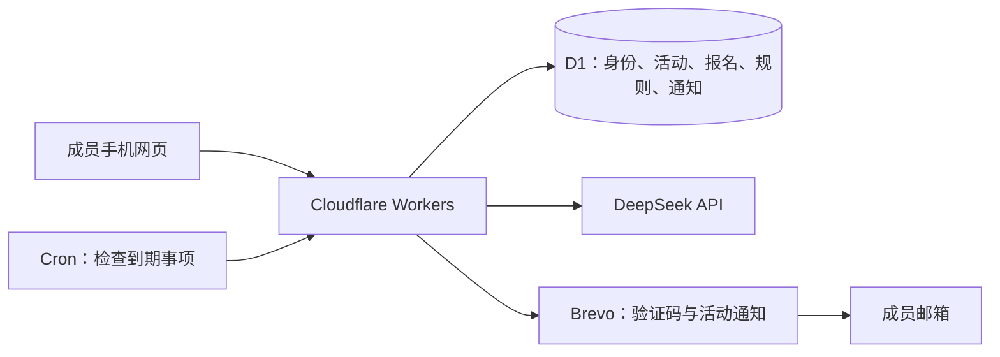

# Data Coffee 架构选择

版本：0.3，2026-09-05。读者：产品负责人及后续开发者。目的：决定服务托管、数据、身份、邮件和后台运行的选型；具体数据模型、接口及状态转换另写详细设计。本版确认开发网站使用 workers.dev、开发邮件使用 zhaidewei.com，保持免费起步方向。

## 1. 已确定的方向

- 托管与 DNS：Cloudflare。开发网站使用 Cloudflare 提供的 `workers.dev` 地址；不再为开发网站使用 `zhaidewei.com` 子域名。实际 Worker 名称和账号子域名尚未核实，示例地址不代表已部署。
- 开发邮件以 `zhaidewei.com` 为发信域名，通过 Brevo 发送验证码与通知；具体发件地址、回复地址以及域名验证记录在接入时确定。网站地址与发信域名独立，`workers.dev` 不用作发信域名。
- 正式网站使用 `nl-dams.com`，具体为根域还是哪个子域名后续确定。正式邮件域名尚未决定，不能把网站域名切换自动视为邮件域名切换。
- AI：DeepSeek API，由服务端调用。
- 当前方案为 Workers Free + Cloudflare D1，邮件优先评估 Brevo Free；用户已接受该免费起步方向。适用性仍需通过账号、域名、投递和性能验证，未开通任何服务。
- 当前以 `docs/requirements-mvp.md` v0.3 为产品范围：个人报名、固定最低人数、先候补后补齐倒计时，场地异常同样限时补齐。

## 2. 推荐组合

| 部分 | 推荐 | 原因及边界 | 状态 |
|---|---|---|---|
| 网页与后端 | Cloudflare Workers Free + Static Assets | 同一部署提供页面资源和业务 API，减少部署单元；认证和后台任务需验证免费 CPU 限制 | 免费起步方向已接受 |
| 数据库 | Cloudflare D1 | 活动、报名、规则、审核、通知均为关系数据；现有项目已用 SQLite 语义，便于保留部分模型与服务逻辑 | 纳入已接受的免费起步方案 |
| 登录 | 邮箱验证码及会话在 Workers 执行，身份数据放 D1 | 延续已确认的产品入口；D1 本身不是完整登录服务，认证组件选型及防重放、限流、会话管理在详细设计中核实 | 实现方向建议 |
| 定时判断 | Workers Cron Triggers | 周期检查已到期活动、补齐期限和待发送通知，无需用户访问网页 | 推荐 |
| 邮件发送 | Brevo Free 优先评估 | 每日 300 封，支持事务邮件；验证码与通知共用每日预算，需核实账号及域名并验证投递 | 评估方向已接受 |
| 邮件备选 | 后续按实测重选或升级 | 免费额度或投递不能满足时再比较 Brevo 付费、Cloudflare Email Sending 等，不自动购买 | 尚未决定 |
| AI | DeepSeek API | 解释和受控工具调用；报名、退出最终仍通过后端规则接口执行 | 已定 |

基础流程：

Workers 可将静态资源与代码一起部署。[官方 Static Assets 文档](https://developers.cloudflare.com/workers/static-assets/)。Cron 支持周期性执行后台任务。[官方 Cron 文档](https://developers.cloudflare.com/workers/configuration/cron-triggers/)。DeepSeek 提供工具调用能力。[官方 Tool Calls 文档](https://api-docs.deepseek.com/guides/tool_calls/)。

开发地址采用 `<worker-name>.<account-subdomain>.workers.dev` 格式，实际部署后回读确定；该域名支持开发测试，无需先设置自有网站域名。[Workers 默认域名文档](https://developers.cloudflare.com/workers/configuration/routing/workers-dev/)。切换正式网站时需同步应用网址、邮件中的活动链接及会话相关配置。

## 3. D1 是否足够

官方免费额度为每天读 500 万行、写 10 万行、账号总存储 5 GB；免费单库上限 500 MB。读写按扫描和写入的行数计费，不能把一次 API 调用当作一行。达到免费日限后查询会报错。[D1 价格](https://developers.cloudflare.com/d1/platform/pricing/)、[D1 限制](https://developers.cloudflare.com/d1/platform/limits/)。

判断：700 位成员、少量城市活动、以文本和报名记录为主，预计数据容量和普通业务量能落在免费额度内。举例，700 人每人一天 10 次操作，每次写入 5 行约为 35,000 行；这只是粗估，尚未计索引维护、通知、认证、定时任务及异常重试。最终以实现后的真实扫描行数和压测确认，不能仅以用户数保证免费。

开发和首场方案先按 Workers Free 评估，不预设生产必须付费。免费账号每日 100,000 次动态请求，每次 HTTP 和 Cron 执行有 10ms CPU 限制；网络等待不计入 CPU，认证和后台批处理仍须实测。只有用量、性能或邮件选型需要时再考虑 Workers Paid（最低 $5/月）。当前域名与 DeepSeek 成本单独计算，未检查已有账号套餐，未开通付费订阅。[Workers 限制](https://developers.cloudflare.com/workers/platform/limits/)、[Workers 价格](https://developers.cloudflare.com/workers/platform/pricing/)。

详细设计必须证明最后名额竞争、重复点击、并发递补和截止判定的一致性。不能原样搬用旧代码中独立执行的“查询人数再插入”流程。持久记录规则版本、变更时点和通知待发项；选型通过不等于现有 SQL 已可安全上线。

## 4. Supabase 免费版比较

官方 Free 包含 50,000 月活用户、500 MB 数据库和 5 GB 出站流量；最多两个活跃免费项目，低活跃项目存在暂停机制。对 700 人的规模，额度有可能足够，真正需要关注的是活动间歇期的运行连续性。[Supabase 价格](https://supabase.com/pricing)、[免费项目暂停规则](https://supabase.com/docs/guides/platform/free-project-pausing)。

Supabase 的价值是整合 Postgres、Auth 等能力。若选择它，认证集成会省去部分开发工作；选择 D1 则需要单独完成验证码与会话实现。当前需求没有明确依赖 Postgres 特性或实时订阅，因此推荐 D1，避免为数据库再引入一个托管平台。若认证或事务实现评估显示明显代价，再重新比较；不把 Supabase 作为与 D1 同时写入的备用数据库。

## 5. 邮件选择与费用

当前优先评估 Brevo Free，每日 300 封，支持事务邮件。首场假设 50 人、每人同日一封验证码和一封成团通知，约 100 封；此为容量示例，仍需计入重发、审核和异常通知。700 人的社区规模不等于每天给全员发信。[Brevo 免费额度](https://help.brevo.com/hc/en-us/articles/208580669-FAQs-What-are-the-limits-of-the-Free-plan)、[Brevo 方案说明](https://help.brevo.com/hc/en-us/articles/208589409-About-Brevo-s-pricing-plans)。

用户已接受该评估方向；仍须确认账号可用、发信域名验证、事务发信权限和实际邮箱投递。接近每日额度时需给验证码和紧急取消通知留预算，达到额度后的延迟与失败必须可见，不能把超额邮件承诺为即时送达。

以下为已研究的备选，不作为当前默认方案：

Cloudflare Email Sending 已公开 Beta，需 Workers Paid，包含每月 3,000 封，超额每千封 $0.35。新账号每日额度从保守值开始，官方没有一个可直接用于本项目的固定保证值。[公开 Beta 公告](https://developers.cloudflare.com/changelog/post/2026-04-16-email-sending-public-beta/)、[邮件价格](https://developers.cloudflare.com/email-service/platform/pricing/)、[发送限制](https://developers.cloudflare.com/email-service/platform/limits/)。

若未来改选 Cloudflare Email Sending，需确认付费计划、发信域名 onboarding 和账号日配额。700 封仅作为可能的集中发信容量评估场景，不作为群发计划；Brevo Free 的每日 300 封也无法覆盖该场景。

Resend Free 为每月 3,000 封、每日 100 封；Pro 为 $20/月，包含每月 50,000 封且无每日配额限制。Free 不适合依赖同日发送 700 封的场景，Pro 可作备选。[Resend 价格](https://resend.com/pricing)。

邮件服务发送能力不等于最终进收件箱。OTP 与活动通知需要区分优先级，并验证常用成员邮箱的投递情况。站内持久通知记录与发送结果分开，失败可重试；“提供商接受”不能展示为“用户已读”。本轮未访问邮件账号、验证域名、购买套餐或实际发信。

## 6. 后台任务的架构约束

建议 Cron 每分钟检查一次到期事项，数据库保存确切截止时刻。页面倒计时按该时刻展示，后台处理可能稍晚；不得因为任务延迟把截止后的报名算入截止时成团条件。每分钟检查是调度方案建议，最终结算延迟目标仍待定，不能承诺秒级执行。

第一版以 D1 保存待发通知，由后台分批处理和重试；OTP 请求立即尝试发信，活动批量通知不占满 OTP 的发送预算。暂不因未来规模预先增加消息队列、对象存储、向量库或复杂持久工作流。若实际发送速度、任务时限或恢复测试显示需要，再引入 Cloudflare Queues 等组件。

## 7. 现有代码与后续工作

已读本地依赖：Data Coffee 为 TypeScript、Vercel、libSQL/MCP 基础；`dams-meetup` 使用 Next.js、Supabase 和 Cloudflare OpenNext。两者都不能仅改部署配置就视为满足新需求。优先保留可复用的业务逻辑及历史数据，重新设计报名一致性、认证和规则生命周期；是否复用具体前端组件待详细设计评估。

免费起步、开发网站 workers.dev、开发邮件 zhaidewei.com 和正式网站 nl-dams.com 的方向已接受。接下来核实实际 Cloudflare 与 Brevo 账号资源，确定具体地址并编写详细设计。接入邮件前检查 zhaidewei.com 既有邮件 DNS，按 Brevo 提供的验证记录配置并回读，保留现有收发信能力。当前仅记录选择，没有创建 Worker、修改 DNS、验证发信域名或发送邮件；账号实际额度仍未知。
