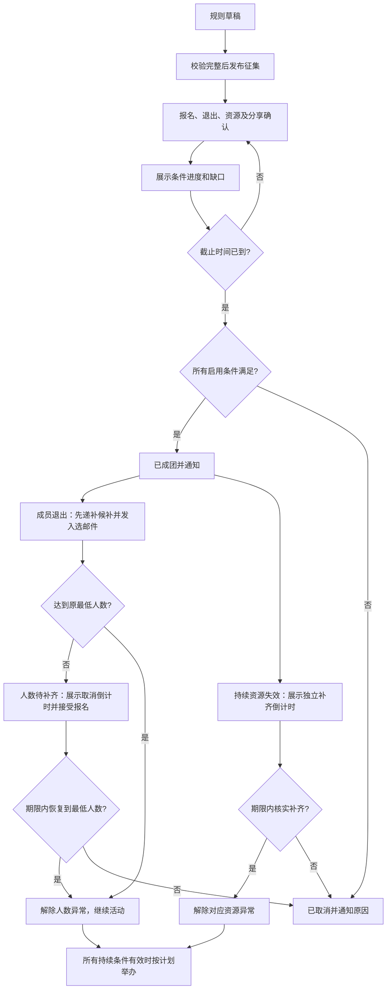

# Data Coffee 需求与 MVP 范围

版本：0.3，2026-09-05。状态：待产品负责人评审，尚未冻结。本版移除同行及代报名，并将人数规则简化为始终维持同一个最低人数。

读者：产品负责人、城市协办者、开发者和验收者。本文说明首版解决什么问题、包含哪些能力，以及怎样判断完成。系统架构、接口和详细测试用例将在范围确认后单独编写。

## 1. 目标与成功定义

目标用户是约 700 位在荷兰从事 Data / AI 工作或学术研究的华人。过去通过微信群发布、接龙和人工汇总组织活动，成员的报名变更集中到发起人，造成重复协调和单点依赖。

产品让发起人提前约定成团规则，成员自行报名和变更、提供资源、申请分享；所有人能看到当前进度，系统在约定时间自动成团或取消。2026 年 10 月先完成一场真实活动的组织闭环。

首场验收关注：成员可以不联系发起人完成普通报名和变更；截止后无需人工判断也能得到正确结果；取消和关键变更能主动通知相关成员；协办者可以接手线下例外。活动是否最终成团取决于真实条件，自动正确取消也是产品成功执行。

## 2. 已确认与建议的边界

### 用户已明确的需求

- 服务上述荷兰华人 Data / AI 社群，组织线下 Data Coffee。
- 支持发布、本人报名与退出、提供资金或场地、申请演讲和状态汇总；同行及代报名已移出本次 MVP。
- 发起人提交确定的规则和决策流程；满足条件成团，不满足自动取消。
- 支持多个城市的活动独立成功或失败。
- 使用 AI 助理协助咨询和参与变更，已有 DeepSeek API key。
- 收款可以后续引入；保持简单，逐步改进，从 10 月活动开始。
- 先确定需求及 MVP，再系统设计、测试用例、开发验收和上线。

### 已确认的范围与规则责任（2026-09-05，D01–D06、D08–D13）

- 中文手机网页为入口，微信群负责分享链接。
- 2026 年 10 月先运行一场，产品能创建多个城市的独立征集。
- 发布时确定成团条件，征集期间实时展示进度；提前达标显示“当前达标”。到截止时间统一判断，全部条件满足则成团，否则自动取消并说明原因。
- 首版支持登记赞助意向，单独展示，不算作已到账资金；暂不接在线收款。10 月首场优先采用免费场地、饮品自付，到账确认及退款规则后续引入。
- 本次仅支持每位参与者验证本人邮箱后自行报名、退出和接收通知，每人一个名额。同行、代报名及独立确认邀请均不在 MVP 范围，原 D04a、D04c 的首版确认已撤回（D04d）。
- 发布者可开启或关闭个人候补，并设定递补截止时间。开启后满额按申请时间排队，有人退出释放名额时，截止前由系统自动将队首转为正式报名并发送邮件；候补者可随时退出队列。首版仅提供这一种排队方式（D04e）。
- 人数门槛、候补、报名与退出期限、场地要求和分享要求均由发布者通过结构化表单配置，自动生成流程图。已确认的是配置范围和决定权，各字段的具体选项、取值约束及组合校验仍待细化；平台执行已发布规则。
- 草稿阶段自由修改；发布后锁定成团和参与规则。日期、人数门槛等重大事项变更时关闭旧征集、重新发布，并通知成员重新确认；描述文字可修正并保留修改记录（D02b）。
- 成员可以申请成为某场活动的协办，由该活动发布人批准；同一活动允许多个协办。申请未获批准时不获得协办权限（D05a）。
- 获批协办可以核实本场资源、审核分享、处理成员咨询；人工取消活动和审批其他协办由发布人负责（D05b）。按规则自动取消仍由系统执行。
- 协办申请未批准前可由申请人撤回；获批协办可以主动退出，发布人也可以撤销其资格。退出或撤销立即停止本场协办管理权限，保留已完成的审核记录并通知相关人员（D05c）。
- 成团后关键资源撤回的处理规则由发布者提前配置：明确必需资源及补齐期限，期限最晚不超过活动开始；撤回时页面立即展示异常并通知发布人和协办，期限内未补齐则系统自动取消并通知成员（D05d）。
- 现场负责人要求、最低协办人数及同一人是否可以兼任，由发布者配置并在发布时明确；系统按本场设置检查已确认的现场负责人和已批准的协办是否满足成团条件（D05e）。示例人数不作为平台统一门槛。
- 首版以“邮箱验证码 + 昵称”登录：浏览活动无需登录，报名或提交申请前验证邮箱；换设备后使用同一邮箱验证可找回原报名。邮箱不公开，也可用于接收成团、取消等通知（D06a）。
- 本人报名和修改在页面立即给出回执；成团、取消、候补转正、申请审批结果及重大变更发送邮件给受影响成员；待处理申请和资源异常通知对应发布人、协办；普通人数变化只更新页面进度（D06b）。
- 活动介绍、规则、人数和资源进度公开；成员自行选择是否公开昵称；发布者选择详细场地地址公开或仅向已报名成员展示；邮箱始终不公开（D06c）。

- AI 首版支持解释规则、查询进度、协助本人报名及退出；写操作先展示明确目标活动和操作内容的确认卡片，用户确认后由系统按规则执行并返回真实结果；所有这些操作保留按钮入口（D08，按 D04d 收窄）。

- 任何完成邮箱验证的成员都可以创建并发布征集，无需额外逐场批准；本场发布者负责设定规则、审批协办和必要的人工取消（D09）。
- 发布者也拥有本场资源核实、分享审核和成员咨询权限；没有协办时可独立处理，有协办时共同分担（D12）。此权限不豁免本场已发布的最低协办人数等成团条件。
- 人数以外的条件可由发布者选择“仅成团时检查”或“持续满足到活动开始”；持续条件失效共用限时补齐、逾期取消流程（D10）。人数始终使用发布时确定的同一个最低门槛（D13）。
- 发布者设定最低人数，成团前后保持不变。成团后有人退出，先按候补规则自动递补并向入选者发邮件；递补后仍不足，启动人数补齐倒计时。倒计时内新报名使人数恢复到最低门槛，解除人数异常；到期仍不足则取消。所有有效报名者不区分角色、每人一次，候补转正前不计入。原保护期和第二套保底人数均撤回（D13）。
- 临近活动时旧场地取消，不立即自动取消活动；进入“等待补齐”状态，公开展示原因、补齐截止时间及取消倒计时。期限内新场地核实后满足本场要求，则解除场地异常及其取消倒计时；逾期仍未补齐才自动取消。场地倒计时为 D05d 的明确展示要求。

- 所有成团条件以征集截止那一刻的有效状态判断，包括人数、场地、分享和协办；执行延迟不能把截止后才生效的变更计入成团判定。截止后的退出或资源撤回进入后续处理流程（D11）。

### 仍需细化的内容

规则字段的具体选项及取值约束仍需明确；具体人数、城市和日期不使用示例自动填入真实活动。地址访问中候补、退出等状态的处理需在权限清单中明确，不能从“已报名”自行扩大访问范围。

## 3. 角色和核心旅程

| 角色 | 要完成的事情 |
|---|---|
| 发起人 | 设定规则、审批协办申请、预览并发布征集、了解结果、核实资源、审核分享、处理成员咨询、必要时人工取消活动 |
| 普通成员 | 查看活动和条件、本人报名、退出、了解自己的状态 |
| 资源提供者 | 提交场地、物资或资金意向，确认承诺，报告撤回 |
| 分享申请者 | 提交主题、摘要和时长，获知审核结果，修改或撤回申请 |
| 协办申请者 | 申请协办某场活动，查看申请结果；由本场发布人批准后成为协办 |
| 城市协办者 | 同一活动可有多人；核实本场资源、审核分享、处理成员咨询；无权人工取消活动或审批其他协办 |
| AI 助理 | 解释已发布规则和当前状态，协助用户执行本人有权限的操作 |

典型旅程：发起人发布征集 → 成员参与和提供资源 → 协办者核实资源及分享 → 系统持续展示缺口 → 截止时自动结算 → 成团后继续管理参与变化并举办，或取消并通知。

## 4. MVP 功能与验收标准

| 编号 | 首版能力 | 验收标准 |
|---|---|---|
| R01 | 创建及发布征集 | 任何完成邮箱验证的成员均可创建、发布征集，无需额外逐场批准；可填写城市、主题、活动时间，并通过结构化表单配置人数门槛、候补、报名与退出期限、场地及分享要求、现场负责人要求、最低协办人数和是否允许兼任；缺少必填条件不能发布；发布前可预览 |
| R02 | 多城市独立活动 | 可创建不同城市的征集；一场人数或资源变化不会改变另一场的状态 |
| R03 | 规则及流程可视化 | 根据发布者配置自动生成流程图；详情页展示全部条件、当前数值、缺口、截止时间和决策流程；文字、图及判断结果一致 |
| R04 | 自助报名和退出 | 登录成员可报名和退出，立即看到自己的有效状态和更新后的汇总；重复操作不重复计数 |
| R05 | 个人候补 | 发布者可开关候补并设置递补截止时间；开启后满额按申请时间排队，截止前有人退出释放名额则自动将队首转为正式报名并发邮件；候补者可随时退出；关闭候补时满额不能加入队列；截止后不再自动递补 |
| R06 | 资源提供 | 可提交场地、物资及资金意向，查看处理状态及撤回；仅已核实资源满足相关成团条件；资金意向明确标注未收款 |
| R07 | 分享申请 | 可提交和撤回申请；本场发布者或已批准的协办可以接受或拒绝并说明原因；只有已确认的分享计入启用的分享门槛 |
| R08 | 自动成团或取消 | 截止后，即使无人访问页面也能完成结算；展示每项判断及取消原因；任务重试不重复结算 |
| R09 | 成团后管理 | 允许按已发布政策退出和递补；发布者预设必需资源及补齐期限，最晚不超过活动开始；成团后关键资源撤回展示异常并通知发布人和协办。旧场地取消先进入“等待补齐”，展示原因、补齐截止时间及取消倒计时，期限内场地核实达标则解除该异常，逾期未补齐才自动取消并通知成员；已取消活动不能继续报名 |
| R10 | AI 助理 | 首版解释规则、查询进度及本人状态，协助本人报名和退出；写操作先展示明确目标活动和操作内容的确认卡片，用户确认后系统按规则执行并返回真实结果；所有这些操作有按钮入口，AI 失败时仍可使用 |
| R11 | 通知 | 本人报名或修改立即显示页面回执；成团、取消、候补转正、申请审批结果及重大变更向受影响成员发送邮件；待处理申请或资源异常通知对应发布人、协办；普通人数变化仅更新页面；能区分发送失败和已交付渠道，不能把站内生成消息等同于送达 |
| R12 | 身份与协办 | 成员只能按权限修改报名；可申请协办，由本场发布人审批并显示结果，允许多个协办；发布人和获批协办均可核实本场资源、审核分享和处理成员咨询；未批准者不能取得协办权限；协办不能人工取消活动或审批其他协办 |
| R13 | 隐私与记录 | 活动介绍、规则、人数和资源进度公开；成员可选择是否公开昵称；发布者可选择详细场地地址公开或仅已报名成员可见；邮箱始终不公开；只有适当角色能看私有资料；可以追溯关键操作、规则版本、时间和结果 |
| R14 | 手机完整使用 | 普通成员无需安装开发工具或配置 MCP，即可在手机上完成浏览、登录、报名及变更 |
| R15 | 协办撤回、退出及撤销 | 申请人可撤回未批准申请；获批协办可主动退出，发布人可撤销资格；退出或撤销后不能继续执行协办管理操作；已完成审核记录保留，相关人员收到通知 |
| R16 | 邮箱登录与恢复 | 未登录可浏览活动；报名和申请前以邮箱验证码验证身份并使用昵称；换设备验证同一邮箱后可访问原报名，不生成重复身份；邮箱不公开，可用于活动通知 |
| R17 | 固定最低人数与补齐 | 发布者设定唯一最低人数，成团前后保持不变；有效报名不分角色、每人一次。退出先处理候补递补并发入选邮件；仍不足才启动补齐倒计时，倒计时内允许新报名，恢复至最低门槛则解除人数异常，逾期仍不足才取消；补齐期限不晚于活动开始。其他持续条件异常独立处理 |

## 5. MVP 不包含

- 同行、代报名、独立确认邀请、邀请占位、整组候补及联动退出；相关旧确认已撤回。
- 在线收款、托管资金、自动退款、收费票及财务结算。
- 任意可编程规则、拖拽通用工作流、多活动间共享资金池。
- 微信群机器人自动接管聊天、自动读取群聊或自动代发群消息。
- AI 自行改规则、核实线下资源真实性或替成员作未经确认的操作。
- 推荐匹配、招聘内推、社交动态、积分声誉、现场互动和活动复盘分析。
- 首场必须在四个城市同时开展。多城市独立活动能力保留。

## 6. 业务规则草案

本节以第 8 节决策记录为确认依据。成团判断、规则变更、配置责任、协办生命周期、资源异常、身份通知及 AI 范围已确认；具体选项和边界细节仍需收敛，不能将草案建议视为已冻结规则。

### 6.1 发布与成团

草稿阶段自由修改，发布征集时锁定成团和参与规则。人数、场地、分享及人员角色要求由发布者配置。现场负责人要求、最低协办人数和是否允许同一人兼任在发布时明确；系统核对已确认的现场负责人、已批准的协办，并按本场兼任规则计数。全部启用条件必须同时满足才成团，该判断原则已确认。

所有成团条件按征集截止那一刻的有效状态统一判断（D11 已确认），涵盖报名与退出、资源核实及撤回、分享确认及撤回、协办批准及退出等。执行延迟不能将截止后生效的变更算入截止判定；截止边界的精确排序需在时间契约与测试中明确。提前达标显示“当前达标，等待截止确认”。截止后发生的退出或资源撤回，在截止判定之后按后续状态规则处理，不能反向改写该次成团结果；已取消的征集仍保持终态。截止后在约定的结算时限内呈现结果，具体时限仍待确定。

### 6.2 人数与候补

统计有效占位的个人报名，每位已验证成员在同一活动只保留一份有效报名、占一个名额；候补不计入。发起人、分享者、资源提供者只有本人明确报名占位后才计入，避免角色重复计算。本人退出仅释放本人的名额。

个人候补规则已确认（D04e）：发布者可开启或关闭候补，并设定递补截止时间。开启后满额按申请时间排队；截止前有人退出释放名额，系统自动将队首转为正式报名并发送邮件，无需再次确认。候补者可随时退出队列。关闭候补时满额不能加入队列，截止后不再自动递补。首版仅采用申请时间顺序。组报名、邀请占位和同行联动不在本次范围，相关问题从待决清单移除。

人数最低门槛由发布者设定，发布后保持不变，成团后持续检查（D13 最新决定）。人数之外的条件仍按 D10 选择检查方式。所有有效报名者均计入，包括发布者、协办、分享者；同一人只计一次，候补未转正前不计入。

有人退出时，先按本场候补规则自动递补，将入选者转为正式报名并发邮件。递补后达到最低人数则继续活动；没有可递补者或递补后仍不足，才启动人数补齐倒计时。倒计时阶段允许新报名；恢复至最低人数时解除该人数异常及其倒计时，逾期仍不足才自动取消并通知。仅有新报名但总人数仍不足，不算补齐，也不因这次报名延长当前倒计时。

例如最低人数为 10：退出后剩 8 人，有 1 名候补转正后为 9 人，进入补齐倒计时；期限内再有 1 人报名则恢复到 10 人继续举办。10 为示例值。补齐期限由发布者预设，仍不晚于活动开始。人数恢复不会解除场地等其他异常。

原取消保护期、较低保底门槛及其切换规则全部撤回。补齐阶段允许报名是本轮确认的行为，报名与递补截止时间的配置必须明确其与补齐阶段的关系，不能使已承诺的补齐报名入口失效；具体时间字段约束待统一整理。

### 6.3 资源、分享和例外

成员可申请协办某场活动，由本场发布人批准，允许多个协办。申请中不获得管理权限，获批资格仅适用于本场活动。获批协办可以核实资源、审核分享、处理成员咨询；人工取消活动和审批其他协办由发布人负责。

申请人可以撤回未批准的申请；获批协办可以主动退出，发布人可以撤销其资格。退出或撤销立即停止本场协办管理权限，保留已完成的审核记录并通知相关人员（D05c 已确认）。

资源提案与已确认资源分开显示。场地需要确认活动时间可用和容量；本场发布者和已批准的协办均可核实资源、审核分享及处理成员咨询（D12）。没有协办时发布者仍可处理这些事项，但成团仍须满足已发布的角色人数条件。AI 仅辅助解释和录入。

发布者提前配置哪些资源属于必需条件，以及撤回后允许的补齐期限，最晚不超过活动开始。成团后关键资源撤回，页面立即展示异常并通知发布人和协办；期限内未补齐则系统自动取消并通知成员。该处理方式已确认（D05d），具体资源和期限由每场活动配置。紧急人工取消仅限本场发布人，必须说明原因并通知；按规则自动取消不需发布人另行审批。

场地临时取消的具体表现已确认：活动进入“等待补齐”，展示场地缺口、补齐截止时间和取消倒计时，给成员提供替代场地的时间，不立即自动取消。期限内新场地经发布人或协办核实并满足本场要求，解除该场地异常及其倒计时；仅提交尚未核实的场地提案不算补齐。逾期仍未补齐才自动取消。其他未解决的持续条件异常不因场地恢复而自动解除。补齐时长由发布者预设；若故障发生时距离开始已不足该时长，是否允许调整活动开始时间属于尚待明确的边界，不能自动延后活动或绕过已确认的规则变更政策。

更换城市、活动日期或成团门槛等重大变更，关闭旧征集、重新发布，通知成员重新确认参与；描述文字可修正并保留修改记录。此变更方式已确认（D02b），文字修正不得改变已锁定规则的含义。取消为终态，不能悄悄恢复旧报名。

### 6.4 身份、信息、通知和 AI

首版使用“邮箱验证码 + 昵称”登录（D06a 已确认）。浏览活动无需登录，报名和申请前必须验证邮箱；换设备后验证同一邮箱可找回原报名，仅输入昵称不能获得已有账号权限。邮箱始终不公开，可用于成团、取消等活动通知。活动介绍、规则、人数和资源进度公开；成员自行选择是否公开昵称；发布者选择详细场地地址公开或仅向已报名成员展示（D06c 已确认）。

AI 首版能力与确认方式已确认（D08）：解释规则、查询进度、协助本人报名及退出。写操作先展示明确目标活动和操作内容的确认卡片，用户确认后由系统按规则执行并返回真实结果。所有这些操作保留按钮入口。AI 能读取完成当前操作所需的最少信息；自然语言不能绕过身份、截止时间、人数和状态规则。首版 AI 写操作范围限于上述成员参与操作，发布、资源和分享申请、协办审批等流程使用常规页面入口。

通知范围已确认（D06b）：本人报名和修改立即显示页面回执；成团、取消、候补转正、申请审批结果和重大变更向受影响成员发送邮件。待处理申请、资源异常通知对应发布人或协办；协办审批事项归发布人，资源及分享审核事项归有相应权限的处理人。普通人数变化仅更新页面进度，不逐次发送邮件。协办资格变更的通知要求沿用 D05c，具体收件人映射在通知清单中细化。

## 7. 首场验收场景目录

这里只定义验收意图；输入数据、步骤和预期结果在测试用例阶段展开。

- AC01：普通成员通过手机链接验证本人邮箱、完成本人报名和退出；每人一份有效报名、一个名额。
- AC02：条件全部满足，到期自动成团；任何硬性条件不足，到期自动取消并解释。
- AC03：多个城市的测试活动分别计算进度与结果，互不影响；无需真实举办四场活动。
- AC04：开启候补后满额按申请时间排队；截止前释放名额时自动递补队首并发邮件，无超额或重复占位；候补者可退出，已退出者不会被递补；关闭候补不能加入队列，递补截止后不再自动转正。
- AC05：资源和分享未确认时不计入；成团后旧场地取消进入等待补齐，展示缺口、明确截止时间和取消倒计时，并通知发布人和协办；期限内替代场地核实达标则解除该异常及倒计时，逾期仍未补齐才自动取消并通知成员；补齐期限不能晚于活动开始，其他未解决异常不被误解除。
- AC06：用户说“我不来了”，确认后确实退出；未确认、越权或 AI 故障不会产生错误修改。
- AC07：成员提交协办申请后，由本场发布人审批；同一活动可批准多个协办；未批准者和其他活动的协办不能取得本场权限；已批准协办能在发布人不在线时核实本场资源、审核分享和处理成员咨询，但不能人工取消活动或审批其他协办；自动取消无需人工批准。
- AC08：截止边界、重复操作和并发报名仍得到唯一正确结果；人为延迟结算时，人数、场地、分享、协办等条件仍按截止时有效状态判断，截止后的变更不改变该次判定而进入后续处理；通知失败可重试并看见失败状态。
- AC09：未授权用户无法修改他人报名、管理规则或读取私有信息。
- AC10：未批准的协办申请可撤回；获批协办可退出，发布人可撤销资格；退出或撤销后立即失去本场协办管理权限，原审核记录仍可追溯，相关人员获知变更。
- AC11：发布者可以配置现场负责人要求、最低协办人数和是否允许兼任；待批准协办不计入已批准人数，未确认现场负责人不满足相应要求；同一人兼任时按本场规则核对，各项结果体现在成团判断与流程图中。
- AC12：未登录可浏览活动；未经邮箱验证不能报名或申请；换设备验证同一邮箱后能访问原报名，昵称相同不能取得他人身份；公开页面不暴露邮箱。
- AC13：报名和修改立即显示页面回执；成团、取消、候补转正、申请审批结果及重大变更产生面向受影响成员的邮件；待处理申请和资源异常通知对应处理人；仅人数增减不产生群发邮件；发送失败与已交付渠道状态可区分。
- AC14：公开访客可见活动介绍、规则、人数和资源进度；未选择公开的昵称不在公开内容中出现；详细地址按发布者设置展示，在仅已报名成员可见模式下不向公开访客泄露；邮箱始终不出现在公开内容中。
- AC15：原同行两种模式的验收已撤回，不属于本次 MVP；本人报名权限由 AC01、AC09、AC12 覆盖。
- AC16：最低人数由发布者设定且成团前后保持不变；所有有效报名者不分角色、每人一次。退出后先自动递补并向入选者发邮件，仍不足才启动倒计时；补齐阶段可新报名，恢复到最低人数则解除人数异常；新报名后仍不足不结束或延长当前倒计时，到期仍不足才取消。候补转正前不计入，其他异常不因人数恢复被解除。

## 8. 待决定事项

| 决策 | 建议 | 状态 |
|---|---|---|
| D01 首版产品范围 | 中文手机网页，微信群分享链接，10 月先运行一场，支持多城市独立征集 | 已确认，2026-09-05 |
| D02 决策方式 | 发布时确定条件，实时展示进度，截止时全部满足则成团，否则自动取消并说明原因 | 已确认，2026-09-05 |
| D02b 发布后变更 | 草稿自由修改；发布后锁定成团和参与规则；重大变更关闭旧征集并重新发布，通知成员重新确认；描述修正保留记录 | 已确认，2026-09-05 |
| D03 资金范围 | 赞助意向单独展示，不算已到账资金；暂不接在线收款；10 月首场优先免费场地、饮品自付，到账确认与退款后续引入 | 已确认，2026-09-05 |
| D04a 同行规则责任 | 原同行配置要求移出本次 MVP | 已撤回，由 D04d 取代 |
| D04b 可配置规则范围 | 人数门槛、候补、报名与退出期限、场地及分享要求由发布者通过结构化表单配置，自动生成流程图；本次不含同行 | 范围及决定权已确认，按 D04d 收窄；具体选项和约束待细化 |
| D04c 同行管理模式 | 原代报名、独立确认两种模式及其确认前占位讨论均不进入本次 MVP | 已撤回，由 D04d 取代 |
| D04d 本人报名范围 | 本次移除整个同行及代报名功能，每位成员验证本人邮箱、自行报名退出、占一个名额并接收本人通知 | 已确认，2026-09-05，取代 D04a、D04c 并收窄 D04b、D08 |
| D04e 个人候补规则 | 发布者开关候补并设递补截止；满额按申请时间排队，截止前释放名额自动递补队首并发邮件；候补可随时退出 | 已确认，2026-09-05 |
| D05a 协办加入方式 | 成员申请，本场发布人批准，允许多个协办 | 已确认，2026-09-05 |
| D05b 协办权限 | 核实资源、审核分享、处理成员咨询；人工取消活动和审批其他协办由发布人负责，系统按规则自动取消不受此限制 | 已确认，2026-09-05 |
| D05c 协办撤回、退出及撤销 | 未批准申请可撤回；获批协办可主动退出，发布人可撤销资格；立即停止管理权限，保留审核记录并通知相关人员 | 已确认，2026-09-05 |
| D05d 关键资源撤回 | 发布者预设必需资源及补齐期限，最晚不超过活动开始；旧场地取消先等待补齐并展示取消倒计时，通知发布人和协办；核实补齐后解除对应异常，逾期未补齐才自动取消并通知成员 | 已确认，2026-09-05；本轮补充场地倒计时要求 |
| D05e 人员角色条件 | 发布者配置现场负责人要求、最低协办人数及是否允许同一人兼任；系统按本场设置判断成团条件 | 已确认，2026-09-05 |
| D06a 登录与恢复 | 邮箱验证码 + 昵称；浏览免登录，报名和申请需验证；同邮箱跨设备找回报名；邮箱不公开，可用于活动通知 | 已确认，2026-09-05 |
| D06b 通知范围 | 报名和修改给页面回执；成团、取消、候补转正、申请审批结果和重大变更发送邮件；待处理申请及资源异常通知对应发布人、协办；普通人数变化仅更新页面 | 已确认，2026-09-05 |
| D06c 公开范围 | 活动介绍、规则、人数及资源进度公开；昵称由成员选择是否公开；详细地址由发布者选择公开或仅已报名成员可见；邮箱始终不公开 | 已确认，2026-09-05 |
| D07 首场配置 | 城市、日期、人数上下限、截止时间、是否必须有分享 | 待确认 |
| D08 AI 操作边界 | 解释规则、查询进度、协助本人报名及退出；明确活动与操作的确认卡片经用户确认后执行，返回真实结果；保留按钮入口 | 已确认，按 D04d 移除同行修改 |
| D09 活动发布资格 | 任何完成邮箱验证的成员可创建、发布征集，无需额外逐场批准；本场发布者负责规则、协办审批和必要的人工取消 | 已确认，2026-09-05 |
| D10 条件持续性 | 人数以外的条件可选仅成团时检查或持续满足到活动开始；持续条件失效共用限时补齐、逾期取消流程；人数按 D13 始终维持原最低门槛 | 已确认，按最新 D13 收窄人数选项 |
| D11 判定时间边界 | 所有条件均按征集截止时有效状态判断，执行延迟不纳入截止后才生效的变更；截止后退出或资源撤回进入后续处理 | 时间原则已确认，2026-09-05；具体结算时限及边界排序待细化 |
| D12 发布者审核权限 | 发布者拥有本场资源核实、分享审核及成员咨询权限；无协办时可独立处理，有协办时共同分担 | 已确认，2026-09-05 |
| D13 固定最低人数与补齐 | 发布者设唯一最低人数，成团前后保持不变；所有有效报名者每人一次；退出先候补递补并发邮件，仍不足再倒计时，期间报名补齐则继续，逾期仍不足取消 | 最新决定已确认；取代原保护期、第二保底门槛及切换规则 |

需求一致性评审已纠正 AC03、AC04 的过早固定，并确认 D12 的发布者审核权限和 D11 的截止判定原则。D04d 已移除同行功能，D04e 已确认个人候补规则；最新 D13 用固定最低人数取代保护期与双门槛。进入系统设计前还需收敛具体结算时限，以及报名、递补截止与补齐期限的配置关系。

D01–D06 中仍有效的决定及 D08–D13 的上述原则已确认；D04a、D04c 已撤回，以 D04d 的本人报名范围为准。下一步统一整理配置选项和约束，检查需求一致性并提交 MVP 范围评审；D07 的具体活动值可在产品范围确定后补齐，正式发布前必须完成。

## 9. 文档与工作目录

专用本地代码库：`/Users/zhaidewei/SHUJUQUN/data_coffee_terminal`。本文为该仓库 `docs/requirements-mvp.md`，作为需求评审的主版本。

旧版 MCP 社区撮合方案及代码入口已经退休，不能视为当前 MVP 需求。先前会话产生的 `data-coffee-design.md` 是探索草案；本文确认后，以本文的产品范围为准。`~/dams-meetup` 的 README 表明其定位为活动现场互动，复用价值留待系统设计阶段评估。

当前仅交付需求草案，未冻结范围、未修改业务代码、未上线。下一步是产品负责人逐项评审范围；之后再编写系统设计和测试用例。

### 城市与候选时间（2026-09-07）
面向发布者和报名者：每场活动固定一个城市，不同城市分别发布活动；报名不再收集自由文本地点。发布者以日历多选候选日期，可批量设置并逐日调整开始结束时间。报名者多选可参加时段，保留交通多选及报名留言。发布者在征集截止前确认最终时段，最低成行人数仅计算该时段中获得席位的人。未确认时间不能成行。旧固定时间活动继续兼容。

### MVP 范围收缩（2026-09-07）
分享和协办退出本轮 MVP，不在创建或 READY 中设置要求。现有活动不再以分享、协办、角色不兼任作为成行或补齐条件；历史记录保留。主流程仅报名与时间、场地、主持人。
